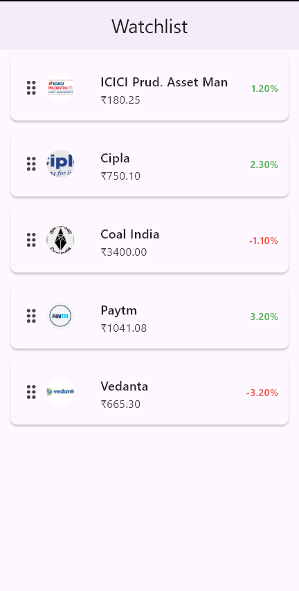

# Bloc Watchlist Demo

## Overview
A Flutter application demonstrating a reorderable stock watchlist using Cubit (BLoC pattern).

## Approach
- Used Cubit for state management since the feature involves a single action (reordering).
- Implemented state separation (loading, loaded, error) for better scalability.
- Maintained immutability using copyWith and Equatable.

## Features
- Drag & reorder stocks
- Clean and responsive UI
- Basic loading simulation

## Project Structure
- model/ → data models
- cubit/ → state management
- screens/ → UI screens
- widgets/ → reusable components

## Preview

## Notes
The implementation focuses on clean architecture, readability, and avoiding over-engineering while maintaining scalability.

## Disclaimer
Logos and images used are for demonstration purposes only and belong to their respective owners.